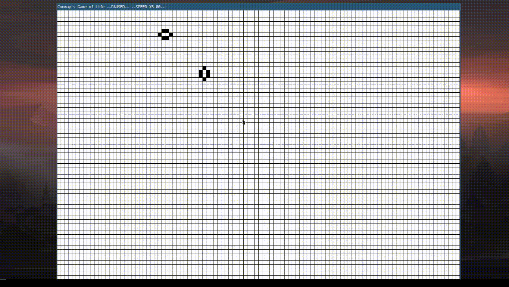
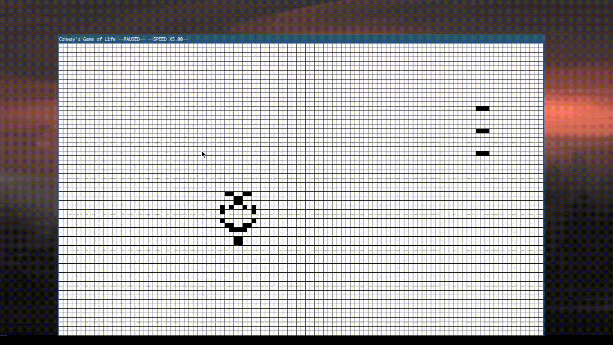
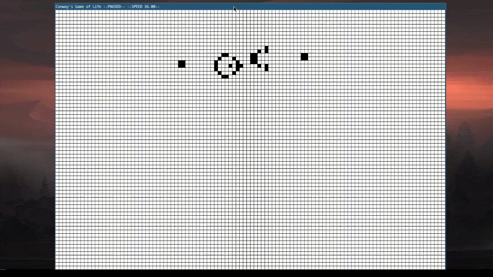

# Conway's Game of Life Engine

This project is a simulation of Conway's Game of Life implemented in C using the Raylib library.

## Introduction

Conway's Game of Life is a cellular automaton devised by the British mathematician John Horton Conway in 1970. It is a zero-player game, meaning that its evolution is determined by its initial state, requiring no further input. One interacts with the Game of Life by creating an initial configuration and observing how it evolves.

## Conway's Game of Life Rules

The Game of Life operates on a two-dimensional grid of cells, each of which can be in one of two possible states: alive or dead. At each step in time, the following rules are applied to each cell:

1. **Underpopulation**: Any live cell with fewer than two live neighbors dies, as if by underpopulation.
2. **Survival**: Any live cell with two or three live neighbors lives on to the next generation.
3. **Overpopulation**: Any live cell with more than three live neighbors dies, as if by overpopulation.
4. **Reproduction**: Any dead cell with exactly three live neighbors becomes a live cell, as if by reproduction.

## Features

- Simulate Conway's Game of Life on a grid.
- Control the simulation speed.
- PAUSED mode: Create and edit the initial state of the grid and Advance the simulation one step at a time.

## Requirements

- [Raylib](https://www.raylib.com/) library installed.

## Usage

1. Clone the repository:

    ```bash
    git clone https://github.com/Ayg0/conwaysGameOfLife.git
    ```

2. Navigate to the project directory:

    ```bash
    cd conwaysGameOfLife
    ```

3. Compile the project:

    ```bash
    make
    ```

4. Run the executable:

    ```bash
    ./conwaysGameOfLife
    ```

## Controls

- **P**: Pause/Resume simulation.
- **+**: Speed up simulation.
- **-**: Slow down simulation.
- **LEFT-CLICK**: Add a living cell --PAUSED ONLY--.
- **RIGHT-CLICK**: Removing a living cell --PAUSED ONLY--.
- **N**: Advance simulation by one frame --PAUSED ONLY--.

## examples:
**Butterfly**

**Copperhead Spaceship**

**Glider Gun**


## Contributing

Contributions are welcome! Feel free to open issues or pull requests for bug fixes, improvements, or new features.
